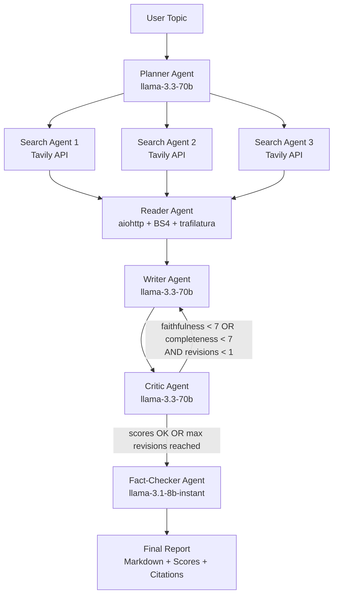

# Multi-Agent Research Assistant

A production-grade research pipeline where a **team of 6 AI agents** autonomously plans, searches the live web, scrapes sources, writes a report, reviews it for quality, and fact-checks every claim — all triggered by a single topic submission.

```
User Topic
  → Planner       — Splits topic into 3-5 focused sub-questions
  → Search Agents — Parallel Tavily API queries per sub-question
  → Reader Agent  — Parallel async scraping (BeautifulSoup + trafilatura)
  → Writer Agent  — Synthesizes sourced markdown report
  → Critic Agent  — Scores faithfulness / completeness / clarity (0-10)
       ↕ (loop back at most 1 time if scores < 7)
  → Fact-Checker  — Cross-checks claims, inserts [Source: URL] citations
  → Final Report  (markdown + scores + source list)
```

## Tech Stack

| Layer | Technology |
|---|---|
| LLM | Groq API — `llama-3.3-70b-versatile` (Planner/Writer/Critic), `llama-3.1-8b-instant` (Fact-Checker) |
| Orchestration | LangGraph `StateGraph` |
| Search | Tavily API |
| Scraping | `aiohttp` (parallel) + BeautifulSoup + `trafilatura` fallback |
| Backend | FastAPI + Pydantic v2, Server-Sent Events streaming |
| Rate Limiting | `slowapi` — 5 req/min per IP |
| Frontend | React 19 + Vite |
| Styling | Vanilla CSS (dark-mode glassmorphism) |
| Testing | pytest (backend), all LLM/API calls mocked |
| CI/CD | GitHub Actions |
| Deployment | Render/Railway (backend) + Vercel/Netlify (frontend) |

---

## Project Structure

```
multi-agent-research-assistant/
├── backend/
│   ├── agents.py          # 6 LLM agent functions (Planner/Search/Reader/Writer/Critic/FactChecker)
│   ├── graph.py           # LangGraph StateGraph pipeline wiring
│   ├── main.py            # FastAPI app — /research (SSE), /health, rate limiting, CORS
│   ├── security.py        # Input sanitization + prompt-injection detection
│   ├── tools.py           # Tavily search + async parallel scraping
│   ├── requirements.txt
│   ├── pytest.ini
│   ├── .env.example
│   └── tests/
│       ├── conftest.py
│       ├── test_tools.py
│       ├── test_graph.py
│       └── test_security.py
├── frontend/
│   ├── src/
│   │   ├── App.jsx
│   │   ├── api.js                    # SSE fetch wrapper (reads VITE_API_URL only)
│   │   ├── index.css                 # Full design system
│   │   └── components/
│   │       ├── SearchBar.jsx         # Topic input + validation
│   │       ├── LoadingSteps.jsx      # Animated pipeline step indicator
│   │       ├── ReportView.jsx        # Markdown report + collapsible sources
│   │       └── ScoreBadge.jsx        # Visual quality score badges
│   ├── .env.example
│   ├── package.json
│   └── vite.config.js
├── .github/
│   └── workflows/
│       └── ci.yml
└── README.md
```

---

## Environment Variables

### Backend (`backend/.env`)

| Variable | Description | Required |
|---|---|---|
| `GROQ_API_KEY` | From [console.groq.com](https://console.groq.com) | ✅ |
| `TAVILY_API_KEY` | From [app.tavily.com](https://app.tavily.com) | ✅ |
| `ALLOWED_ORIGINS` | Comma-separated frontend origins | ✅ (prod) |

### Frontend (`frontend/.env`)

| Variable | Description | Required |
|---|---|---|
| `VITE_API_URL` | Backend base URL (no trailing slash) | ✅ |

> ⚠️ **Never commit `.env` files.** Both are gitignored by default.

---

## Local Development

### 1. Clone & navigate

```bash
git clone <your-repo-url>
cd multi-agent-research-assistant
```

### 2. Backend setup

```bash
cd backend

# Create and activate virtual environment
python -m venv .venv
# Windows:
.venv\Scripts\activate
# macOS/Linux:
source .venv/bin/activate

# Install dependencies
pip install -r requirements.txt

# Configure environment
cp .env.example .env
# Edit .env and add your GROQ_API_KEY and TAVILY_API_KEY

# Start the API server
uvicorn main:app --reload --port 8000
```

Backend will be available at: `http://localhost:8000`
Interactive API docs: `http://localhost:8000/docs`

### 3. Frontend setup

```bash
cd frontend

# Install dependencies
npm install

# Configure environment
cp .env.example .env
# .env already points to http://localhost:8000 by default

# Start dev server
npm run dev
```

Frontend will be available at: `http://localhost:5173`

### 4. Run backend tests

```bash
cd backend
pytest tests/ -v
```

All tests are fully mocked — no real API keys needed to run them.

---

## Deployment

### Backend → Render (recommended)

1. Push your code to GitHub
2. Go to [render.com](https://render.com) → **New Web Service**
3. Connect your repository, set:
   - **Root Directory**: `backend`
   - **Build Command**: `pip install -r requirements.txt`
   - **Start Command**: `uvicorn main:app --host 0.0.0.0 --port $PORT`
   - **Environment**: Python 3.11
4. Add environment variables in the Render dashboard:
   - `GROQ_API_KEY`
   - `TAVILY_API_KEY`
   - `ALLOWED_ORIGINS` → `https://your-app.vercel.app`
5. Deploy — Render gives you a URL like `https://your-api.onrender.com`

### Backend → Railway (alternative)

```bash
# Install Railway CLI
npm install -g @railway/cli
railway login
cd backend
railway init
railway up
# Set env vars in Railway dashboard
```

### Frontend → Vercel (recommended)

1. Go to [vercel.com](https://vercel.com) → **New Project**
2. Import your GitHub repository
3. Set:
   - **Root Directory**: `frontend`
   - **Framework Preset**: Vite
   - **Build Command**: `npm run build`
   - **Output Directory**: `dist`
4. Add environment variable:
   - `VITE_API_URL` → `https://your-api.onrender.com`
5. Deploy

### Frontend → Netlify (alternative)

```bash
cd frontend
npm run build
# Drag & drop the `dist/` folder to netlify.com/drop
# Or use the CLI:
npm install -g netlify-cli
netlify deploy --dir=dist --prod
```

---

## Security Features

- **No API keys in frontend** — all keys live in backend `.env` only
- **Input sanitization** — strips whitespace, enforces 300-char limit
- **Prompt injection detection** — 15+ regex patterns block malicious inputs
- **SystemMessage/HumanMessage separation** — user content never enters system prompts
- **Rate limiting** — 5 requests/min per IP via `slowapi`
- **Timeouts** — 8s scrape timeout, 30s LLM timeout, graceful fallbacks
- **CORS** — restricted to configured frontend origins in production
- **No secrets in logs** — only truncated snippets are logged

---

## API Reference

### `POST /research`

Submit a topic and receive a streaming SSE response.

**Request:**
```json
{ "topic": "Future of quantum computing" }
```

**SSE Events streamed:**
```
event: progress
data: {"step": "planning", "label": "Planning research sub-questions"}

event: progress
data: {"step": "searching", "label": "Querying live web sources"}

... (searching → reading → writing → reviewing → fact_checking → done)

event: result
data: {
  "topic": "Future of quantum computing",
  "report": "# Research Report...",
  "scores": {"faithfulness": 9, "completeness": 8, "clarity": 9},
  "sources": ["https://...", "https://..."],
  "revision_count": 0,
  "elapsed_seconds": 42.5
}
```

**Error responses:**
- `400` — Invalid topic (too long or contains injection patterns)
- `429` — Rate limit exceeded (5 req/min per IP)

### `GET /health`

```json
{ "status": "ok", "version": "1.0.0" }
```

---

## Architecture Diagram


